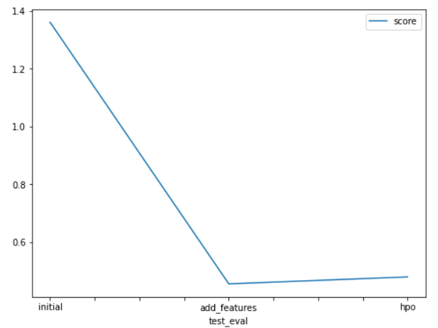

# Report: Predict Bike Sharing Demand with AutoGluon Solution
#### Amit Lathiya

## Initial Training
### What did you realize when you tried to submit your predictions? What changes were needed to the output of the predictor to submit your results?
TODO: While submitting the prediction I realized that predictions has some negative values for RMSE score. Now we know that kaggle will reject the prediction if we don't set everything to be greater than 0. So to handle this scenario first I took the count on how many negative scores predictor returned and then I set all the negative predictions to 0. Finally I assign those predictions to submission dataframe

### What was the top ranked model that performed?
TODO: Top ranking model was second model which I trained after performing the feature engineering. 

## Exploratory data analysis and feature creation
### What did the exploratory analysis find and how did you add additional features?
TODO: From EDA I noted two main observation: 
1) Plotting histogram on all features gave insight into how data is distributed for each feature. 'season' and 'weather' features clearly represent categorical data distribution with distinct values whereas rest of the other features represents contiguous data distribution exept 'workday' and 'holiday' which represents binay data distribution. Given that we can map 'season' and 'weather' features to categorical dtype. 

2) Another observation was datetime column which can be splitted into 'year', 'month', 'day', 'hour' and 'weekday' features and removed the original 'datetime' feature column. These features provide time element information to each record.   

### How much better did your model preform after adding additional features and why do you think that is?
TODO: Model significantly performed better after adding the additional features. RMSE score reduced from 1.36123 to 0.45526. That's close to 65% improvement.  

## Hyper parameter tuning
### How much better did your model preform after trying different hyper parameters?
TODO: Model performance slightly degraded after trying different hyper parameters. RMSE kaggle score on test data increased from 0.45 to 0.47 approximately. 

### If you were given more time with this dataset, where do you think you would spend more time?
TODO: I would spend more time doing following experiments. 
1) Evaluate different model algorithms such as Random Forest, XGBoost, GBM, NN and AdaBoost 
2) Choose the best performing model algo from step 1. 
3) Perform hyperparameter tuning on best chosen model. 
4) Get the best performing model after tuning and compare the results against the initial benchmark or kaggle leaderboard to assess how well final model performed. 
5) I would also explore on different feature engineering techniques such as feature scaling, dropping irrelevant columns etc  

### Create a table with the models you ran, the hyperparameters modified, and the kaggle score.
|model|hpo1|hpo2|hpo3|score|
|--|--|--|--|--|
|initial|'default'|'default'|'default'|1.36123|
|add_features|'default'|'default'|'default'|0.45526|
|hpo|'GBM, NN'|'GBM, NN'|'GBM, NN'|0.47932|

### Create a line plot showing the top model score for the three (or more) training runs during the project.

TODO: Replace the image below with your own.

### Create a line plot showing the top kaggle score for the three (or more) prediction submissions during the project.

TODO: Replace the image below with your own.

## Summary
TODO: In this case study we build the regression model to predict the bike demand given the bike sharing historical data. I first analyzed the features,  plotting sample rows and using pandas describe method. Then I build initial first model with default parameters and without doing much temparing with the features. Got the initial RMSE score after training the model. This was initial benchmark established.

Next step was to perform EDA and analyze data pattern in features. Based on plots I took decision to engineer existing feature changing dtype from numeric to categorical, added new features to capture time element information for each record. Then I trained the model and this significant improved RMSE Kaggle score on test data by 65%. 

With preprocessed features, I decided to tune hyperparameters for model algorithm. Two of my choice were GBM (tree based model) and deep neural network with different hyperparameter setting. After the training the model for increased duration I couldn't get model any better. Instead there was slight increase in RMSE score from 0.45 to 0.47. I think with more options for hyperparameters and increased duration for model training I can get better model score. 

At last I compared the Kaggle score of all trained model and plotted these scores against hyperparameter settings to analyze the relative improvement or degradation in performance.  